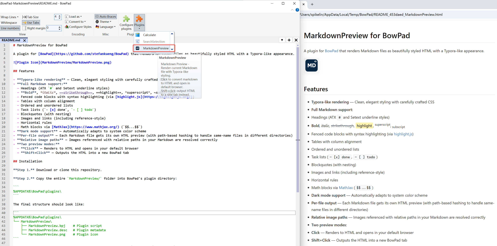

# MarkdownPreview for BowPad

A plugin for [BowPad](https://github.com/stefankueng/BowPad) that renders Markdown files as beautifully styled HTML and opens in default browser.
Code generated by vibe coding with [CodeBuddy](https://www.codebuddy.ai/)


## Features

- **Typora-like rendering** — Clean, elegant styling with carefully crafted CSS
- **Full Markdown support:**
  - Headings (ATX `#` and Setext underline styles)
  - **Bold**, *italic*, ~~strikethrough~~, ==highlight==, ^superscript^, ~subscript~
  - Fenced code blocks with syntax highlighting (via [highlight.js](https://highlightjs.org/))
  - Tables with column alignment
  - Ordered and unordered lists
  - Task lists (`- [x] done`, `- [ ] todo`)
  - Blockquotes (with nesting)
  - Images and links (including reference-style)
  - Horizontal rules
  - Math blocks via [MathJax](https://www.mathjax.org/) (`$$...$$`)
- **Dark mode support** — Automatically adapts to system color scheme
- **Per-file output** — Each Markdown file gets its own HTML preview (with path-based hashing to handle same-name files in different directories)
- **Relative image paths** — Images referenced with relative paths in your Markdown are resolved correctly
- **Two preview modes:**
  - **Click** — Renders to HTML and opens in your default browser
  - **Shift+Click** — Outputs the HTML into a new BowPad tab

## Installation

**Step 1.** Download or clone this repository.

**Step 2.** Copy the entire `MarkdownPreview/` folder into BowPad's plugin directory:

```
%APPDATA%\BowPad\plugins\
```

The final structure should look like:

```
%APPDATA%\BowPad\plugins\
└── MarkdownPreview\
    ├── MarkdownPreview.bpj    # Plugin script
    ├── MarkdownPreview.desc   # Plugin metadata
    └── MarkdownPreview.png    # Plugin icon
```

**Step 3.** Restart BowPad. The **Markdown Preview** button will appear in the plugin toolbar.

## Usage

1. Open any Markdown (`.md`) file in BowPad.
2. Click the **Markdown Preview** plugin button:
   - **Click** → Generates an HTML file in `%TEMP%\BowPad\` and opens it in your default browser.
   - **Shift+Click** → Outputs the rendered HTML into a new BowPad tab.

   
   
### Output File Naming

Preview HTML files are saved to `%TEMP%\BowPad\` with the naming pattern:

```
{filename}_{hash}_MarkdownPreview.html
```

- `{filename}` — The original file name (without extension), with special characters replaced by underscores
- `{hash}` — A short hash derived from the full file path, ensuring that files with the same name in different directories produce separate previews

For example:
| Source File | Preview HTML |
|---|---|
| `C:\projA\README.md` | `README_2a4f1c3_MarkdownPreview.html` |
| `C:\projB\README.md` | `README_5e3b8d7_MarkdownPreview.html` |
| `D:\docs\notes.md` | `notes_1f7c2a0_MarkdownPreview.html` |

## Screenshots

### Light Mode
The default rendering uses a clean white theme with elegant typography:

- Carefully tuned font stack (Segoe UI, Microsoft YaHei, Source Han Sans SC, etc.)
- Syntax-highlighted code blocks
- Styled tables with hover effects
- Smooth fade-in animations

### Dark Mode
Automatically activates when your system uses a dark color scheme, with adjusted colors for comfortable reading.

## Requirements

- [BowPad](https://github.com/stefankueng/BowPad) (version with plugin support)
- Windows (uses ActiveX/COM for file I/O and browser launching)
- A modern web browser for viewing the rendered HTML

## Technical Details

- Written in **JScript** (ES3-compatible, no ES6 features) to work with BowPad's IActiveScript plugin engine
- The Markdown parser is implemented entirely from scratch — no external dependencies at runtime
- Code highlighting is loaded from the [highlight.js CDN](https://cdnjs.cloudflare.com/ajax/libs/highlight.js/11.9.0/)
- Math rendering is loaded from the [MathJax CDN](https://cdnjs.cloudflare.com/ajax/libs/mathjax/3.2.2/)
- HTML files are written using `ADODB.Stream` with UTF-8 encoding for full Unicode support

## Changelog

See [CHANGELOG.md](CHANGELOG.md) for release history.

## License

This project is licensed under the [MIT License](LICENSE).
